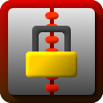
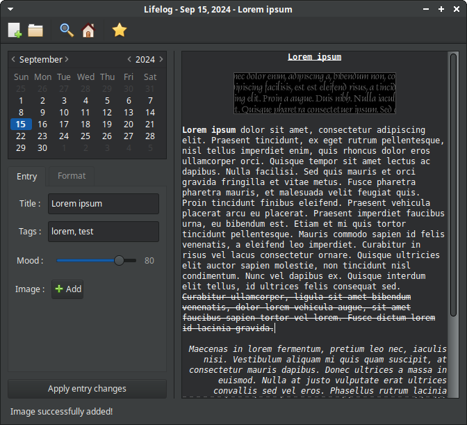

<p align="center">
  
  <h1 align="center">Lifelog</h1>
</p>

<!-- Badges -->
<p align="center">
  
  
  <br />
  
  
  <br />
  
  
  
</p>

<!-- Screenshot and description-->
<p align="center">A simple and secure diary app using <b>Python</b>, <b>SQLite</b> and <b>GTK+ 3</b>.</p>

<p align="center"></p>

<!-- Table of contents -->
<p align="center">
    <a href="#installation">Installation</a>
    ·
    <a href="#usage">Usage</a>
    ·
    <a href="#features">Features</a>
    ·
    <a href="#contribute">Contribute</a>
    ·
    <a href="#license">License</a>
</p>

<!-- Installation -->
<h2 id="installation">Installation</h2>

1. Install the dependencies :

- For **Ubuntu/Debian-based distributions**
    ```
    sudo apt install python3 python3-pip cmake libcairo2-dev gobject-introspection libgirepository-1.0-dev
    ```
- For **Arch Linux**
    ```
    sudo pacman -S python python-pip cmake cairo gobject-introspection libgirepository
    ```

2. (*Optional*) Set up a virtual environment :
    ```
    python3 -m venv myenv
    source myenv/bin/activate
    ```

3. Install Lifelog from PyPI :
    ```
    pip3 install lifelog
    ```

4. **OR** install Lifelog from source:
    ```
    pip3 install setuptools
    git clone https://github.com/MrBeam89/lifelog.git
    cd lifelog
    python3 setup.py bdist_wheel sdist
    pip3 install .
    ```

<!-- Usage -->
<h2 id="usage">Usage</h2>

1. Start Lifelog with the following commands : `lifelog` or `python3 -m lifelog`
2. Create a diary or open an existing one :
   
   - Click on the New File icon (at the top left) or `Ctrl+N`
   - **OR** Click on the Open File icon or `Ctrl+O`

3. Set a password (minimum length : 8 characters) or type the existing one.

> [!WARNING]
> If you forget your password, **you will be unable** to retrieve your lost data.

4. **:tada: You can now start writing ! :tada:**

<!-- Features -->
<h2 id="features">Features</h2>

- **Simple and intuitive interface** : Designed with simplicity in mind.
- **Title and tags** : Make searching for specific entries easier.
- **Mood tracking** : Scale from 0 to 100.
- **Rich text** : Bold/italic/underline/strikethrough text, and paragraph alignment.
- **Image support** : Supports the following formats (by default) : **JPEG**, **PNG**, **ICO** and **BMP**.
- **Encryption** : Uses **AES-256** along with **scrypt** to protect your data.
- **Searching** : Find specific entries between two dates by their titles or their tags.

<!-- Contribute -->
<h2 id="contribute">Contribute</h2>

See [CONTRIBUTING.md](CONTRIBUTING.md).

<!-- License -->
<h2 id="license">License</h2>

This program is free software: you can redistribute it and/or modify
it under the terms of the **GNU General Public License** as published by
the Free Software Foundation, either **version 3 of the License, or
(at your option) any later version**.

This program is distributed in the hope that it will be useful,
but WITHOUT ANY WARRANTY; without even the implied warranty of
MERCHANTABILITY or FITNESS FOR A PARTICULAR PURPOSE. See the
GNU General Public License for more details.
